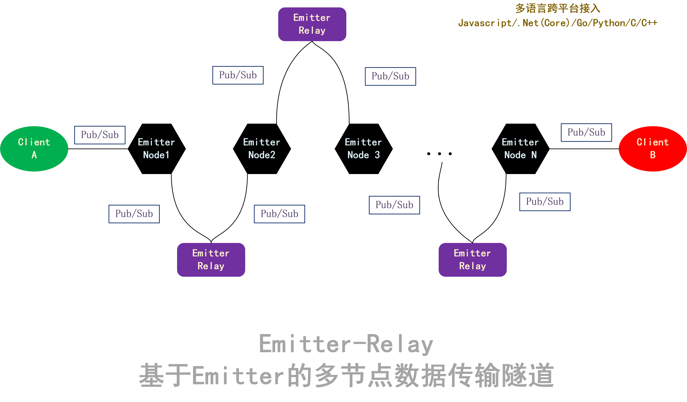

# Emitter-Relay
multi-hop relay based on emitter. 
基于Emitter的多节点数据传输隧道。

# Features
1. 多语言接入支持
2. 不限层级的隧道连接，理论上可以支持任意层级，假如不考虑延时
3. 支持断线重连
4. 端到端加密（拟计划支持中）
5. 消息持久化/失败重传（拟计划支持中）
6. 动态随机路由，支持数据的动态随机信道切换和转发（拟计划支持中）

# Security
* Emitter 信道TSL原生加密支持
* 每个节点仅暴露上下跳连接信息
* 传输内容支持端到端加密，传输链路过程中始终处于加密状态

# RoadMap
- [x] 多节点转发
- [ ] 端到端加密
- [ ] 消息持久化/失败重传
- [ ] 动态随机路由